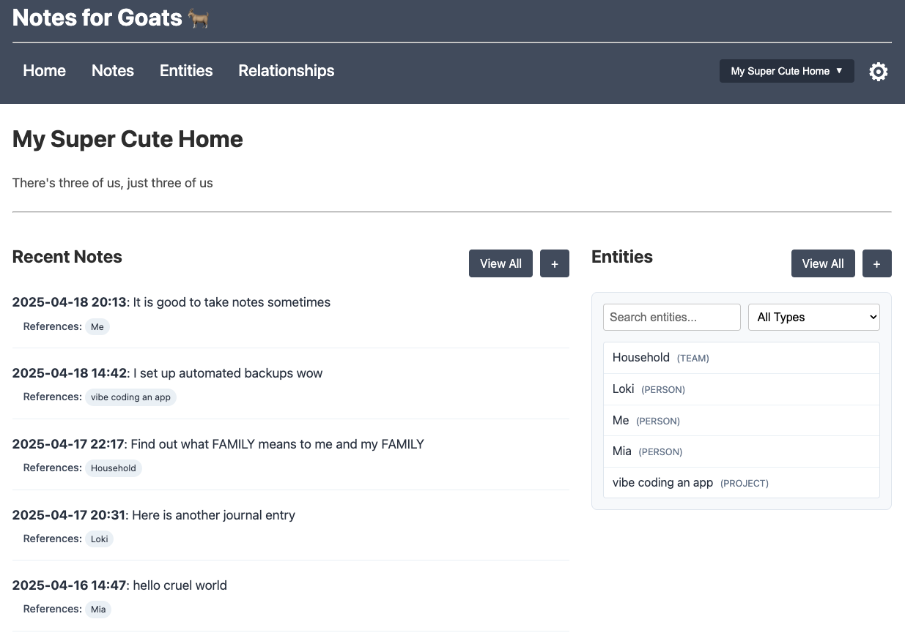
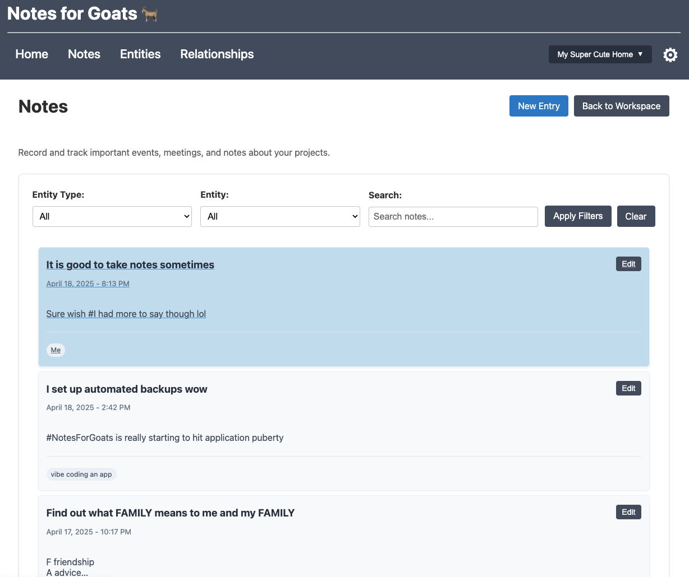
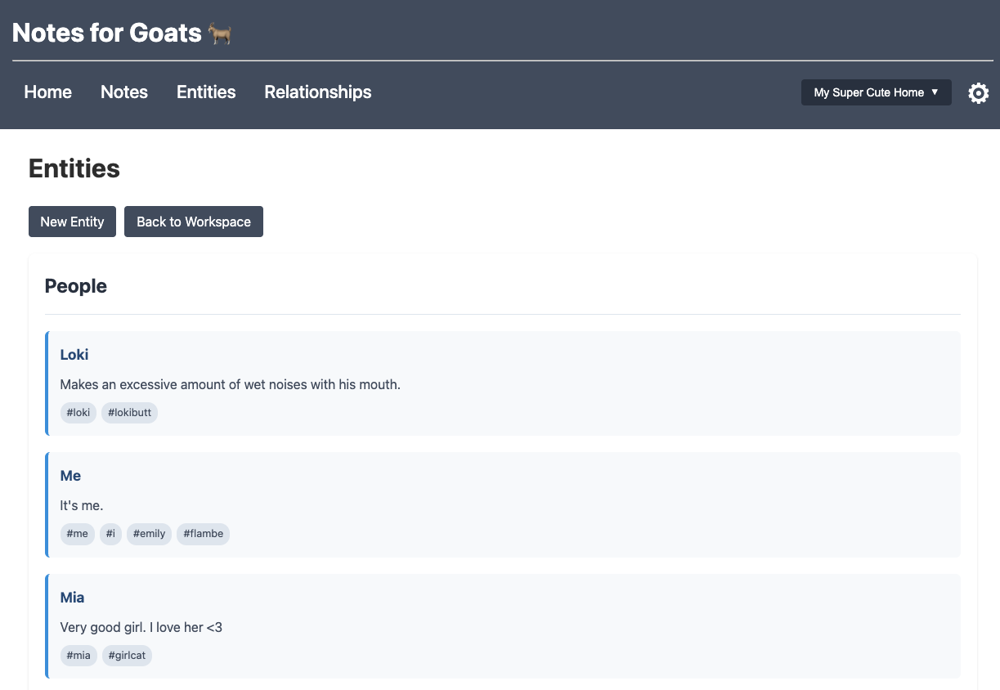
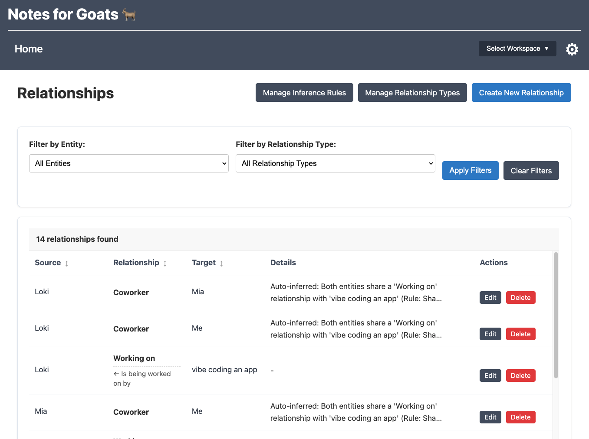
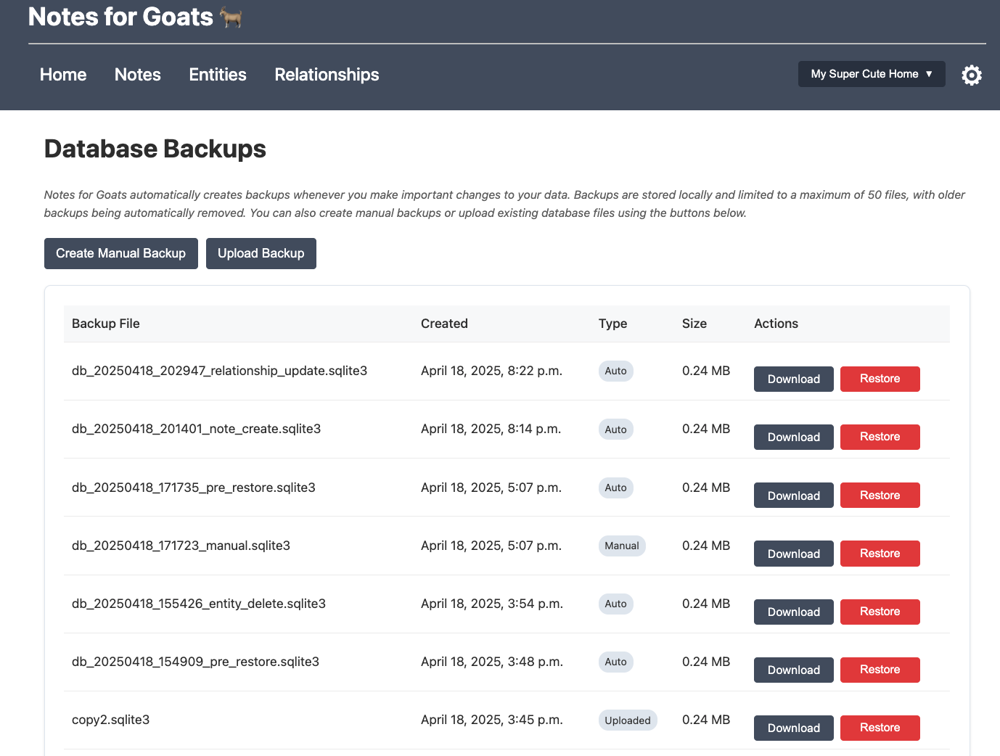

# Notes for Goats

A personal note-taking application designed for professionals to organize structured notes about people, projects, and daily events.

<details>
<summary>📸 Behold, screenshots! (click to expand)</summary>







</details>

## Installation

### Option 1: Using Docker (Recommended)

The easiest way to get started is with Docker:

1. **Prerequisites**
   - [Docker](https://www.docker.com/get-started)
   - [Docker Compose](https://docs.docker.com/compose/install/) (usually included with Docker Desktop)

2. **Setup and Launch**
   
   ```bash
   # Clone the repository
   git clone https://github.com/yourusername/notes-for-goats.git
   cd notes-for-goats
   
   # Build and start the application
   docker-compose up -d
   
   # Create an admin user (first time only)
   docker-compose exec web python notes_for_goats/manage.py createsuperuser
   ```

3. **Access the application**
   - Main app: http://localhost:8000/
   - Admin interface: http://localhost:8000/admin/

4. **Stop the application**
   
   ```bash
   docker-compose down
   ```

### Option 2: Standard Installation

If you prefer to run directly on your machine:

1. **Prerequisites**
   - Python 3.8+

2. **Setup**
   
   ```bash
   # Clone the repository
   git clone https://github.com/yourusername/notes-for-goats.git
   cd notes-for-goats
   
   # Create and activate a virtual environment
   python -m venv venv
   source venv/bin/activate  # On Windows: venv\Scripts\activate
   
   # Install dependencies
   pip install -r requirements.txt
   
   # Set up the database and create admin user
   python manage.py migrate
   python manage.py createsuperuser
   
   # Run the development server
   python manage.py runserver
   ```

3. **Access the application**
   - Main app: http://127.0.0.1:8000/
   - Admin interface: http://127.0.0.1:8000/admin/

## How to Use Notes for Goats

### Workspaces

Workspaces are like separate notebooks that help you organize different areas of your life:

- Create separate workspaces for different jobs, projects, or contexts
- Each workspace has its own entities, notes, and relationships
- Switch between workspaces using the dropdown in the navigation bar

### Entities

Entities are the core building blocks in Notes for Goats:

1. **What are Entities?**
   - People (colleagues, clients, team members)
   - Projects (initiatives, products, assignments)
   - Teams (departments, working groups, committees)

2. **Creating Entities**
   - Navigate to "Entities" and click "New Entity"
   - Select a type (Person, Project, or Team)
   - Enter a name and optional details
   - Add tags to make entities easier to find

3. **Using Entities**
   - View all entities from the Entities page
   - Click on any entity to see its details and related notes
   - Filter entities by type or search by name/tags

### Notes

Notes let you capture information while automatically connecting to relevant entities:

1. **Creating Notes**
   - Navigate to "Notes" and click "New Note"
   - Give your note a title and content
   - Use #hashtags to reference entities (e.g., "Meeting with #Alice about #ProjectX")

2. **Entity References**
   - Any entity name preceded by # will be detected as a reference
   - Referenced entities appear at the bottom of the note
   - Click on a referenced entity to view its details

3. **Viewing Notes**
   - Browse all notes from the Notes page
   - Filter notes by date or search by content
   - View notes related to specific entities from their detail pages

### Relationships

Relationships help you track connections between entities:

1. **Relationship Types**
   - Define custom relationship types (e.g., "Reports To", "Works On")
   - Set whether relationships are directional (one-way) or bidirectional
   - Configure inverse names for directional relationships (e.g., "Reports To" ↔ "Manages")

2. **Creating Relationships**
   - From an entity's detail page, click "Add Relationship"
   - Select the relationship type and the related entity
   - Add optional details about the relationship

3. **Relationship Inference**
   - Set up rules to automatically create relationships based on patterns
   - Example: When two people work on the same project, create a "Collaborator" relationship
   - Automatically maintain your organizational structure with minimal effort

## Data Backup and Migration

Keep your valuable notes safe:

### Backup Options

1. **Export Workspaces (Recommended)**
   - From the Workspace Settings page, click "Export Workspace"
   - Saves all workspace data as a JSON file that can be imported later

2. **Direct Database Backup**
   - For standard installations: Copy the `db.sqlite3` file to a secure location
   - For Docker installations:
     ```bash
     docker-compose exec web bash -c "cd notes_for_goats && python manage.py export_data"
     ```

### Importing Data

1. **Import a Workspace**
   - From the Workspaces page, click "Import Workspace"
   - Select your exported JSON file
   - Review and confirm the import

## Planned Features

<!-- Fill out your planned features here -->

## License

This project is licensed under the MIT License - see the LICENSE file for details.

---

*Notes for Goats: Because even leaders need to keep track of their flock* 🐐📝