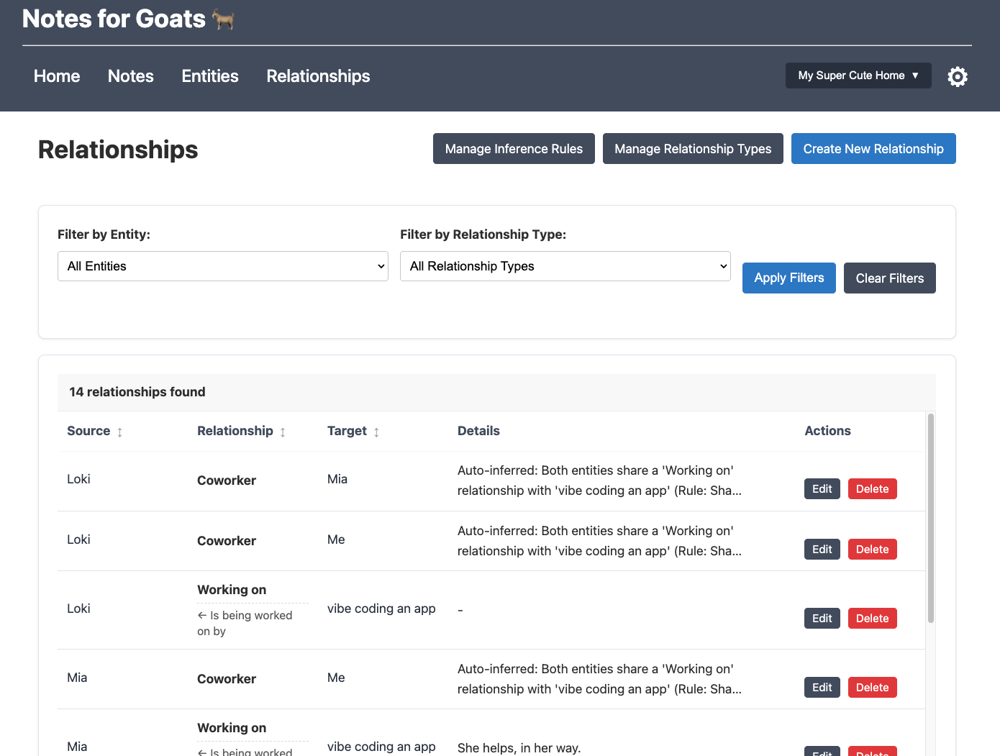

# Notes for Goats

A personal note-taking application designed for professionals to organize structured notes about people, projects, and daily events.

<details>
<summary>📸 Screenshots (click to expand)</summary>





</details>

## Installation

### Option 1: Using Docker (Recommended)

1. **Prerequisites**
   - [Docker](https://www.docker.com/get-started)
   - [Docker Compose](https://docs.docker.com/compose/install/) (usually included with Docker Desktop)

2. **Setup and Launch**
   
   ```bash
   # Clone the repository
   git clone https://github.com/yourusername/notes-for-goats.git
   cd notes-for-goats
   
   # Set up environment variables
   make env
   
   # Build and start the application
   docker-compose up -d
   
   # Create an admin user (first time only)
   docker-compose exec web python notes_for_goats/manage.py createsuperuser
   ```

3. **Access**
   - Main app: http://localhost:8000/
   - Admin interface: http://localhost:8000/admin/

### Option 2: Standard Installation

1. **Prerequisites**
   - Python 3.8+

2. **Setup**
   
   ```bash
   # Clone the repository
   git clone https://github.com/yourusername/notes-for-goats.git
   cd notes-for-goats
   
   # Set up environment variables
   make env
   
   # Create and activate a virtual environment
   python -m venv venv
   source venv/bin/activate  # On Windows: venv\Scripts\activate
   
   # Install dependencies
   pip install -r requirements.txt
   
   # Set up the database and create admin user
   python manage.py migrate
   python manage.py createsuperuser
   
   # Run the development server
   python manage.py runserver
   ```

## Setting Up AI Features

Notes for Goats supports two AI backends: local models via Ollama (recommended for privacy and no costs) or OpenAI (faster but requires API key).

### Option 1: Local AI with Ollama (Recommended)

Run AI features locally with complete privacy and no usage costs:

1. **Install Ollama**
   
   ```bash
   # macOS
   brew install ollama
   
   # Linux
   curl -fsSL https://ollama.com/install.sh | sh
   
   # Windows: Download from ollama.com/download/windows
   ```

2. **Download a model**
   
   ```bash
   # Download Llama 3 (recommended)
   ollama pull llama3
   ```

3. **Configure Notes for Goats**
   
   When running `make env`, set these values:
   ```
   USE_LOCAL_LLM=True
   LOCAL_LLM_URL=http://localhost:11434
   LOCAL_LLM_MODEL=llama3
   ```

### Option 2: OpenAI API (Alternative)

For faster responses with OpenAI's powerful models:

1. **Get an API key** from [platform.openai.com/api-keys](https://platform.openai.com/api-keys)

2. **Configure Notes for Goats**
   
   When running `make env`, enter your OpenAI API key when prompted.

3. **Toggle in the UI**
   
   You can switch between local and OpenAI models directly in the Ask AI interface.

## How to Use Notes for Goats

### Workspaces

Organize your notes into separate contexts:

- Create workspaces for different projects, roles, or areas of focus
- Each workspace has its own entities, notes, and relationships
- Switch between workspaces via the navigation bar

### Entities

The building blocks of your knowledge base:

- **Types**: People, Projects, and Teams
- **Creation**: Navigate to "Entities" → "New Entity" → select type
- **Usage**: View all entities, search by name/tags, or filter by type

### Notes

Record information while automatically linking to entities:

- **Create**: Add new notes with title and content
- **Link**: Use #hashtags to reference entities (e.g., "Meeting with #Alice about #ProjectX")
- **Browse**: Filter notes by date, search content, or view by related entity

### Relationships

Track connections between entities:

- Create relationship types (e.g., "Reports To", "Works On")
- Add relationships from entity detail pages
- Set up inference rules for automatic relationship creation

### Ask AI

Interact with your notes using natural language:

1. Click "Ask AI" from any workspace
2. Type your question
3. Choose between local LLM or OpenAI
4. Get answers based on your notes, entities, and relationships

**Example Questions:**
- "Summarize what I know about Project X"
- "What were the key points from my meeting with Alice last week?"
- "What connections exist between the Marketing and Sales teams?"

**Privacy Note**: Local LLM queries never leave your computer, while OpenAI queries are processed in the cloud.

## Data Backup and Migration

Keep your valuable notes safe:

1. **Export Workspaces**
   - Workspace Settings → Export Workspace → Save JSON file

2. **Database Backup**
   - Standard installation: Copy `db.sqlite3`
   - Docker: 
     ```bash
     docker-compose exec web bash -c "cd notes_for_goats && python manage.py export_data"
     ```

## Troubleshooting AI Features

### Local LLM Issues

If Ollama isn't working:

- Verify it's running: `ollama list`
- Test API directly:
  ```bash
  curl -X POST http://localhost:11434/api/generate \
    -H "Content-Type: application/json" \
    -d '{"model":"llama3","prompt":"Hello","stream":false}'
  ```
- Check `LOCAL_LLM_URL` doesn't include `/api` at the end
- For best performance: 16GB+ RAM, GPU or Apple Silicon recommended

### OpenAI Issues

- Verify your API key is valid
- Check for rate limiting or quota issues
- Ensure your OpenAI account has billing set up

## Planned Features

- RAG-based AI for more efficient querying of large note collections
- Google Calendar integration
- Note templates
- Visual relationship graphs

## License

This project is licensed under the MIT License - see the LICENSE file for details.

---

*Notes for Goats: Because you're worth it* 🐐📝